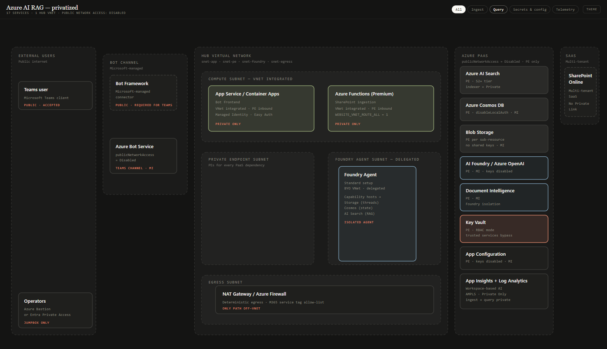

# Azure AI RAG - Private Lab

This repo deploys a private Azure AI retrieval-augmented generation lab for a Teams bot, Foundry agents, AI Search, SharePoint ingestion, and observability. The architecture inherits from the Microsoft baseline private Foundry chat pattern and adapts it for a lightweight lab deployment.

## Contents

- [Architecture](#architecture)
- [Reference Architecture](#reference-architecture)
- [Networking](#networking)
- [Identity & RBAC](#identity--rbac)
- [Privatization Compromises](#privatization-compromises)
- [Prerequisites](#prerequisites)
- [Authentication](#authentication)
- [Deploy](#deploy)
- [Validation](#validation)
- [Day-2 Operations](#day-2-operations)
- [Observability](#observability)
- [Teardown](#teardown)
- [References](#references)

## Architecture

▶ **[Open the interactive architecture diagram](https://samsmith-msft.github.io/azure-ai-rag-private-lab/diagram/architecture.html)**

[](https://samsmith-msft.github.io/azure-ai-rag-private-lab/diagram/architecture.html)

> The PNG is a static preview. Click the PNG or the link above for the interactive version. The source is committed at `diagram/architecture.html`. GitHub READMEs cannot run JavaScript, so the interactive diagram is hosted through GitHub Pages.

## Reference Architecture


Source: [Baseline Microsoft Foundry Chat reference architecture](https://learn.microsoft.com/en-us/azure/architecture/ai-ml/architecture/baseline-microsoft-foundry-chat)

This lab adapts the baseline pattern in six ways:

1. NAT Gateway instead of Azure Firewall.
2. Bot Service for Teams instead of an App Service web UI.
3. Functions ingestion from SharePoint plus Document Intelligence.
4. Cross-region AI Search private endpoint, with Search in Central US and the private endpoint in the primary hub VNet.
5. Azure Monitor Private Link Scope with `PrivateOnly` for monitoring.
6. App Configuration added for centralized settings.

> Region note: this lab deploys to West US 3 by default. The original baseline targets East US 2, but App Service quota in East US 2 is zero by default in many subscriptions. West US 3 has the same private-endpoint, AI, and AMPLS surface. Change `location` in `infra/main.bicepparam` if your subscription has a different region with non-zero quota.

> AI Search tier note: AI Search is deployed at `standard` (S1) by default. The full baseline uses S2 to enable indexer-with-skillset over private endpoints. S2 has zero default quota in many subscriptions; S1 still supports the push ingestion pattern used here (the Function reads SharePoint, calls Document Intelligence, and writes directly to Search).

> Model note: the Foundry account deploys `gpt-5.4-mini` (GlobalStandard) and `text-embedding-3-small` (GlobalStandard). Older `gpt-4o-mini` is deprecated and rejected at preflight as of 2026-03-31.

## Networking

### Subnet plan

| Subnet | Prefix | Purpose |
| --- | --- | --- |
| `snet-compute` | `10.0.1.0/24` | App Service and Functions VNet integration with NAT egress. |
| `snet-pe` | `10.0.2.0/24` | Private endpoints for platform services. |
| `snet-foundry-agent` | `10.0.3.0/27` | Foundry Agent Service capability host subnet. |
| `snet-egress` | `10.0.4.0/26` | Reserved outbound subnet with NAT Gateway. |
| `AzureBastionSubnet` | `10.0.5.0/26` | Azure Bastion operator access. |
| `snet-jump` | `10.0.6.0/27` | Jump VM for portal and private endpoint validation. |

### Private DNS zones

| Zone | Service |
| --- | --- |
| `privatelink.services.ai.azure.com` | Foundry account and project endpoints |
| `privatelink.openai.azure.com` | Azure OpenAI model endpoints |
| `privatelink.cognitiveservices.azure.com` | Cognitive services endpoints |
| `privatelink.search.windows.net` | AI Search private endpoint |
| `privatelink.documents.azure.com` | Cosmos DB |
| `privatelink.blob.core.windows.net` | Storage blob endpoints |
| `privatelink.vaultcore.azure.net` | Key Vault |
| `privatelink.azconfig.io` | App Configuration |
| `privatelink.azurewebsites.net` | App Service and Functions |
| `privatelink.monitor.azure.com` | Azure Monitor |
| `privatelink.ods.opinsights.azure.com` | Log Analytics ingestion |
| `privatelink.oms.opinsights.azure.com` | Log Analytics query |
| `privatelink.agentsvc.azure-automation.net` | Azure Automation agent service telemetry |


Source: [Foundry Agent Service networking](https://learn.microsoft.com/en-us/azure/architecture/ai-ml/architecture/baseline-microsoft-foundry-chat#networking)

## Identity & RBAC

| Managed identity | Assigned to | Main responsibilities |
| --- | --- | --- |
| `uami-bot` | Bot app | Call Foundry project, read configuration, and access required secrets. |
| `uami-ingestion` | Function app | Read SharePoint content through Graph, process documents, write blobs, and update AI Search. |
| `uami-foundry` | Foundry resources | Operate Foundry resources that require managed identity access. |

RBAC uses managed identities instead of shared keys. Storage has shared key access disabled. Key Vault, Storage, Cosmos DB, Document Intelligence, AI Search, App Configuration, and Foundry access are granted through Azure RBAC roles such as Key Vault Secrets User, Storage Blob Data Contributor, Search Index Data Contributor, Search Service Contributor, App Configuration Data Reader, and Cognitive Services User.

## Privatization Compromises

- Foundry account `networkAcls.defaultAction = 'Allow'` is required by Agents Standard. The compensating control is a restrictive NSG on the agent subnet.
- Bot Service Teams channel relies on the public Bot Framework connector. This accepted exposure is limited to the Teams channel path.
- SharePoint Online has no Private Link support for this workflow. Ingestion egress goes through NAT Gateway only.
- NAT Gateway is simpler and lower cost than Azure Firewall, but it does not provide layer 7 inspection or centralized allow-list enforcement.
- The operator jump VM in `snet-jump` has outbound internet access through the NAT Gateway. This is required because the Microsoft Foundry portal at `https://ai.azure.com` serves its UI shell, authentication redirects, and JavaScript assets from public endpoints, even though all Foundry data plane API calls from the browser still flow over the private endpoint. The DATA plane stays private; the CONTROL plane (sign-in, portal shell, asset loading) leaves through the NAT Gateway's known public IP.

## Prerequisites

- Azure subscription with permissions to create resource groups, private endpoints, managed identities, role assignments, and AI services.
- GitHub CLI (`gh`) for repository operations.
- Azure CLI (`az`) and Bicep CLI.
- GitHub Codespaces can be used instead of a local workstation because the dev container installs Azure CLI, Bicep, and GitHub CLI.

## Authentication

```bash
az login --tenant <your-tenant-id>
az account set --subscription <your-subscription-id>
az account show --query "{tenantId:tenantId, subscriptionId:id, name:name}" --output table
```

## Deploy

### Configure parameters

`infra/main.bicepparam` is a template with placeholders. Copy it to `infra/main.deploy.bicepparam` (which is git-ignored) and fill in:

| Param | Notes |
| --- | --- |
| `deployerObjectId` | Run `az ad signed-in-user show --query id -o tsv` to get yours. |
| `tenantId` | Your Microsoft Entra tenant GUID. |
| `sharePointSiteId` | The GUID of your SharePoint Online site (Graph: `GET /sites/<host>:/sites/<name>?$select=id`). Leave empty if you will wire ingestion later. |
| `jumpVmAdminPassword` | Strong Windows password, 12-123 chars, with complexity. Stored locally only; never push this file. |
| `location` | Defaults to `westus3`. Change if your subscription has App Service quota in another region. |
| `aiSearchLocation` | Defaults to `centralus`. Service-only - the private endpoint is created in the hub VNet automatically. |

```bash
cp infra/main.bicepparam infra/main.deploy.bicepparam
# edit infra/main.deploy.bicepparam in your editor
```

### Run in GitHub Codespaces

1. Open the repo in Codespaces.
2. Authenticate with device code:

```bash
az login --use-device-code --tenant <your-tenant-id>
az account set --subscription <your-subscription-id>
```

3. Review and deploy:

```bash
az deployment sub what-if --location westus3 --template-file infra/main.bicep --parameters infra/main.deploy.bicepparam

az deployment sub create --location westus3 --template-file infra/main.bicep --parameters infra/main.deploy.bicepparam
```

### Local bash

```bash
git clone https://github.com/samsmith-MSFT/azure-ai-rag-private-lab.git
cd azure-ai-rag-private-lab
az login --tenant <your-tenant-id>
az account set --subscription <your-subscription-id>
cp infra/main.bicepparam infra/main.deploy.bicepparam
# edit infra/main.deploy.bicepparam to fill placeholders
```

Run the what-if gate first:

```bash
az deployment sub what-if --location westus3 --template-file infra/main.bicep --parameters infra/main.deploy.bicepparam
```

If the what-if output is expected, deploy:

```bash
az deployment sub create --location westus3 --template-file infra/main.bicep --parameters infra/main.deploy.bicepparam
```

### Known issue: Foundry account / PE race

The AVM `avm/ptn/ai-ml/ai-foundry` pattern occasionally fails on the first apply with `AccountProvisioningStateInvalid` because the pattern fires the Foundry account private endpoint before the account has finished provisioning. The fix is to re-run `az deployment sub create` with the same parameters; the deployment is idempotent and the second run picks up where the first one stopped. Expect to need one re-run on a fresh deploy.

## Validation

- From a VM in the VNet, run `nslookup <service-name>.search.windows.net` and confirm it resolves to a private IP.
- Run `az resource list --resource-group rg-ailab-rag-westus3 --query "[].{name:name,type:type}" --output table`.
- Confirm `az resource list --resource-group rg-ailab-rag-westus3 --query "[?properties.publicNetworkAccess=='Enabled']"` returns an empty list (the Foundry account is the documented exception - see Privatization Compromises).
- Confirm Storage has shared key access disabled.
- Confirm AI Search is in `centralus` and its private endpoint is in the primary hub VNet.
- Confirm AMPLS ingestion and query access modes are `PrivateOnly`.
- Confirm the Function app can reach SharePoint through NAT Gateway and can write to AI Search.

## Day-2 Operations


Source: [Ingress to Foundry](https://learn.microsoft.com/en-us/azure/architecture/ai-ml/architecture/baseline-microsoft-foundry-chat#ingress-to-foundry)

### Reaching the jump VM

The deployment creates a Windows 11 Pro jump VM (`Standard_D2as_v5`, Hybrid Benefit on) in the `snet-jump` subnet. It has no public IP. Inbound access is via Bastion only. Outbound traffic routes through the NAT Gateway so the VM can reach the Foundry portal, Microsoft Learn, and other public endpoints needed for day-2 operator tasks; data plane API calls to Foundry / Search / Cosmos / Storage / Key Vault still travel over the private endpoints inside the hub VNet.

| Field | Value |
| --- | --- |
| VM | `vm-jump-<suffix>` |
| Bastion host | `bas-ragbot-lab-<suffix>` |
| Username | The value you set for `jumpVmAdminUsername` (default `azureuser`) |
| Password | The value you set for `jumpVmAdminPassword` in `infra/main.deploy.bicepparam` |

Connect via the portal (Bastion blade > Connect > RDP) or via the Bastion native RDP CLI extension:

```bash
az network bastion rdp \
  --name bas-ragbot-lab-<suffix> \
  --resource-group rg-ailab-rag-westus3 \
  --target-resource-id $(az vm show -g rg-ailab-rag-westus3 -n vm-jump-<suffix> --query id -o tsv)
```

> Hybrid Benefit: the VM is provisioned with `licenseType: Windows_Client`. By deploying this template you attest that you hold a qualifying Windows 10/11 Enterprise license with Software Assurance, or a Windows VDA per-user subscription. See the [Windows Client Azure Hybrid Benefit terms](https://learn.microsoft.com/en-us/azure/virtual-machines/windows/windows-desktop-multitenant-hosting-deployment) before enabling.

### Post-deploy steps

The Bicep deployment provisions infrastructure and capability hosts. **Several manual configuration steps remain before the RAG agent can answer questions.** See [**POST-DEPLOY.md**](./POST-DEPLOY.md) for the complete runbook: RBAC grants, SharePoint site setup, AI Search index creation, Foundry shared private links, Function App publishing from the jump VM, agent + Knowledge Base creation, and end-to-end validation. Read it before connecting to anything.

Quick path:

1. Connect to the jump VM via Azure Bastion (credentials in `infra/main.deploy.bicepparam`, gitignored).
2. Follow [POST-DEPLOY.md](./POST-DEPLOY.md) sections 1 through 13.
3. Validate with the 6 sample prompts in section 13.

> Hybrid Benefit reminder: by deploying this template you attest you hold a qualifying Windows 10/11 Enterprise license with Software Assurance or a Windows VDA per-user subscription. See the [Windows Client Azure Hybrid Benefit terms](https://learn.microsoft.com/en-us/azure/virtual-machines/windows/windows-desktop-multitenant-hosting-deployment).

## Observability


Source: [Azure Monitor Private Link security](https://learn.microsoft.com/en-us/azure/azure-monitor/fundamentals/private-link-security)

The deployment creates Log Analytics, Application Insights, and AMPLS. Ingestion and query public access are disabled where supported, and AMPLS is configured with `PrivateOnly` modes so telemetry flows over Azure private networking.

## Teardown

```bash
az group delete --name rg-ailab-rag-westus3 --yes --no-wait
```

Key Vault uses purge protection. If you need to reuse the same vault name, purge the deleted vault after the retention period and only when your governance policy allows it.

## References

- [Baseline Microsoft Foundry Chat reference architecture](https://learn.microsoft.com/en-us/azure/architecture/ai-ml/architecture/baseline-microsoft-foundry-chat)
- [Foundry Agent Service networking](https://learn.microsoft.com/en-us/azure/architecture/ai-ml/architecture/baseline-microsoft-foundry-chat#networking)
- [Ingress to Foundry](https://learn.microsoft.com/en-us/azure/architecture/ai-ml/architecture/baseline-microsoft-foundry-chat#ingress-to-foundry)
- [Azure Monitor Private Link security](https://learn.microsoft.com/en-us/azure/azure-monitor/fundamentals/private-link-security)
